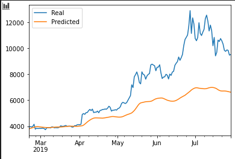
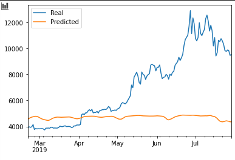
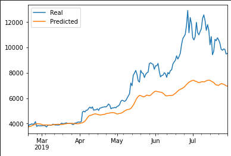
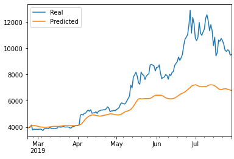
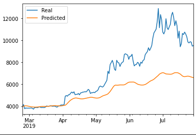

# lstm_stockpredictor

________________
On this repository, I use LSTM to compare prediction performance for bitcoin based purely on one (1) input feature: stock closing price or on fear and greed index.

Each LSTM predictor was loaded into individual notebooks and analyzed to respond to 3 questions: 

&ensp; **Question No. 1: Which model has a lower loss?:** To compare performances, the code <code>model.evaluate(X_test, y_test)</code> was used. The model that used the fear and greed index (fng) produced a loss of 0.1353 while the model based on closing prices 0.0616. Therefore, the closing price model performed better.

&ensp; **Question No. 2: Which model tracks the actual values better over time?:** For this question I resourced to chart each model predicted value versus the actual bitcoin price (summarized in table 1). By looking at the charts it can be concluded that the closing price model predicts closer the real price versus the fng model (on the right). It is worth mentioning that both models use the same window size (10) and 3 layers of neurons composed of 30 units and a dropout of 20%.

  Table 1 

<table>
  <tr>
    <td>LSTM with closing price </td>
     <td>LSTM with fng index</td>
  </tr>
  <tr>
    <td></td>
    <td></td>
    
  </tr>
</table>

&ensp; **Question No. 3: Which window size works best for the model?:** to analyze this a series of iterations were run changing the window size and comparing the resulted loss along with predicted values tracking of real values (Table 2). From this iteration, the window size that worked best for the model was size 15, as the loss was reduced (to 0.0532) while the predicted values tracked better the real closing values (was smooth).

  Table 2 

<table>
  <tr>
    <td>Window size 10- base (loss: 0.0616)</td>
     <td>Window size 5 (loss: 0.0490)</td>
     
  </tr>
  <tr>
    <td></td>
    <td></td>
    
  </tr>
  <tr>
     <td>Window size 15 (loss: 0.0532)</td>
     <td>Window size 20 (loss: 0.0606)</td>
  </tr>
  <tr>
    <td></td>
    <td></td>
  </tr>
</table>

________________
### **Resources**
The Artificial Intelligence image is license free  Photo by <a href="https://unsplash.com/@markuswinkler?utm_source=unsplash&amp;utm_medium=referral&amp;utm_content=creditCopyText">Markus Winkler</a> on <a href="https://unsplash.com/s/photos/brain?utm_source=unsplash&amp;utm_medium=referral&amp;utm_content=creditCopyText">Unsplash</a>

____

### **Packages and libraries**

The imported libraries and packages used to complete the analysis are available on [requirements.txt](https://github.com/CacheKatch/lstm_stockpredictor/blob/main/requirements.txt)

